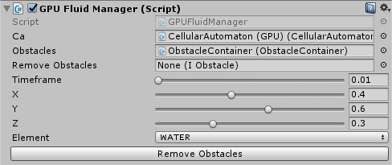
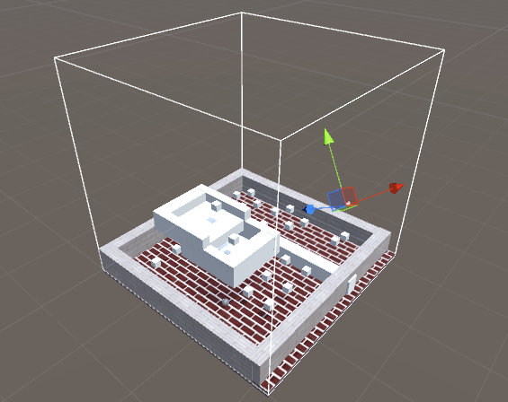

# CA-Fluid-Simulation
3D Fluid Simulation for Unity based on a Cellular Automaton

In the following are some step-by-step instructions to help you set up the fluid simulation for your own Unity-project. Our project also contains some sample-scenes that you might also find usefull. 

## 1. The Cellular Automaton

The first thing you need is the cellular automaton (CA) itself. To create the CA you need a GameObject, where you can add the [CellularAutomaton](https://github.com/Frager/CA-Fluid-Simulation/blob/master/Cellular%20Automaton%20on%20GPU/Assets/Scripts/GPU%20Fluid%20CA/CellularAutomaton.cs)-script. In the inspector you can see three items. 

The first one is a reference to the ComputeShader with the update rules for the CA. You can create your own or use ours, that is in the Resources/Compute Shader/CA folder. The second item consists of three sliders. You can set the size of the CA with these sliders. Only multiples of 16 are possible, because of the [numthreads](https://msdn.microsoft.com/de-de/library/windows/desktop/ff471442(v=vs.85).aspx)-settings in the ComputeShader. The last item is a reference to a GameObject with the [GPUVisualisation](https://github.com/Frager/CA-Fluid-Simulation/blob/master/Cellular%20Automaton%20on%20GPU/Assets/Scripts/GPU%20Fluid%20CA/Visualisation/GPUVisualisation.cs)-script or a subclass.

## 2. The Input of the Cellular Automaton

Now we have set up the CA. Nothing will happen yet, as it still is completly empty. To change that we need to set up a fluid input. This is done by the [GPUFluidManager](https://github.com/Frager/CA-Fluid-Simulation/blob/master/Cellular%20Automaton%20on%20GPU/Assets/Scripts/GPU%20Fluid%20CA/GPUFluidManager.cs)-script.

This class has a little bit more itmes. The first item is just a reference to the GameObject with the [CellularAutomaton](https://github.com/Frager/CA-Fluid-Simulation/blob/master/Cellular%20Automaton%20on%20GPU/Assets/Scripts/GPU%20Fluid%20CA/CellularAutomaton.cs)-script, we set up in the first step. The next two items are optional and only relevant if you use static obstacles. You can find an introduction below. The Timeframe-slider determines how often the ca performs an update, in this example every 0.01 seconds. The next three sliders determine the position, where fluid is filled in. They are in a range from 0 to 1, so that they don't depend on the Dimension-setting in the CA. Note that since the borders of our CA are blocked, values near 0 or 1 will stop the fluid inflow. The Element-dropdown determines what element will flow into the CA. At the moment there are three default elements: Water, oil and gas. You can of course create your own elements. You can find the instructions for that below. If you have set up everything so far, but cannot see any fluid this might be because you haven't set up the visualisation yet. Just follow the next step for that.

## 3. The Visualisation 

If you have followed steps 1 and 2 you should now have a CA and a fluid input. Because we haven't set up the visualisation yet, you probably wont see anything hapening yet. For that we will use the [MarchingCubesVisualisation](https://github.com/Frager/CA-Fluid-Simulation/blob/master/Cellular%20Automaton%20on%20GPU/Assets/Scripts/GPU%20Fluid%20CA/Visualisation/MarchingCubesVisualisation.cs).

The fist thing you have to do, is to add this script to your main camera. This is neccessary because the script uses the [OnPostRender](https://docs.unity3d.com/ScriptReference/MonoBehaviour.OnPostRender.html) method. The next item is the Offset-vector that determines where the fluid will be rendered in WorldSpace. This can not be changed at runtime. The Scale-vector indicates the size of the visualisation. This is of course independent from the size of the cellular automaton, which only determines the number of cells and therefore determines how finely the fluid is rendered. To help you with the positioning the visualisation is rendered as an gizmo in the scene view.

The "Type" dropdown will change the shape of the fisualisation. At the moment there are four options: CUBES, SIMPLE, TESSELATION and MULTIPLE\_FLUIDS. CUBES produces a voxelised visualisation. SIMPLE generates a smoother mesh and TESSELATION a mesh with more polygons, that should give a more wavy look. MULTIPLE\_FLUIDS is intended to visualize several liquids, better than the other types. The last dropdown sets the shading type. You can use the three standard types: FLAT, GOURAUD and PHONG.

----------

## Adding Static Obstacles

Static obstacles are objects that will block fluid flow into cells. You can thing of them like walls. To set up static obsticles all you need is one script, the [ObstacleContainer](https://github.com/Frager/CA-Fluid-Simulation/blob/master/Cellular%20Automaton%20on%20GPU/Assets/Scripts/GPU%20Fluid%20CA/Interfaces/ObstacleContainer.cs).

All the objects you want to act as an obstacle must now be referenced in the Obsticles Array of the [ObstacleContainer](https://github.com/Frager/CA-Fluid-Simulation/blob/master/Cellular%20Automaton%20on%20GPU/Assets/Scripts/GPU%20Fluid%20CA/Interfaces/ObstacleContainer.cs). NOTE: At the moment only cubic objects are fully supported. Finally the reference to the [ObstacleContainer](https://github.com/Frager/CA-Fluid-Simulation/blob/master/Cellular%20Automaton%20on%20GPU/Assets/Scripts/GPU%20Fluid%20CA/Interfaces/ObstacleContainer.cs) must be set in the [GPUFluidManager](https://github.com/Frager/CA-Fluid-Simulation/blob/master/Cellular%20Automaton%20on%20GPU/Assets/Scripts/GPU%20Fluid%20CA/GPUFluidManager.cs). It is also possible to remove and set obsticles at runtime if you have set up another [ObstacleContainer](https://github.com/Frager/CA-Fluid-Simulation/blob/master/Cellular%20Automaton%20on%20GPU/Assets/Scripts/GPU%20Fluid%20CA/Interfaces/ObstacleContainer.cs) in the reference field "Remove Obstacles" in the [GPUFluidManager](https://github.com/Frager/CA-Fluid-Simulation/blob/master/Cellular%20Automaton%20on%20GPU/Assets/Scripts/GPU%20Fluid%20CA/GPUFluidManager.cs). Important: All GameObjects in the "Remove Obsticles" container must also be in the "Obstacles" container.

## Floating Rigidbodies

It is possible to make some objects float on the fluid surfaces. The first thing you need is a GameObject(prefferably an Empty) in your scene, with the [FloatableManager](https://github.com/Frager/CA-Fluid-Simulation/blob/master/Cellular%20Automaton%20on%20GPU/Assets/Scripts/GPU%20Fluid%20CA/Interfaces/FloatableManager.cs) script attached to it. Note that you will only need one FLoatableManager in your scene.

The only paramter you need is a reference to the [CellularAutomaton](https://github.com/Frager/CA-Fluid-Simulation/blob/master/Cellular%20Automaton%20on%20GPU/Assets/Scripts/GPU%20Fluid%20CA/CellularAutomaton.cs). Now for every Gameobject you want to float on Liquids you will need to add the Rigidbody Component (enable gravity) and the [IFloatable](https://github.com/Frager/CA-Fluid-Simulation/blob/master/Cellular%20Automaton%20on%20GPU/Assets/Scripts/GPU%20Fluid%20CA/Interfaces/IFloatable.cs) script. The Gameobject should now float on liquids.

To Influence the floating behavior of a Gamebject you can change the falues of five paramters in the Inspector of the IFloatable Component. The "Density" describes on what liquids the Gameobject will float. For example a density value 2 means, that the object will only float on fluids with a density greater or equal to 2, ignoring liquids with a lower density. The "Float Height" can be used to change how high a floating object will protrude from the fluid. "Boyance Damp" changes how much a object will 'bounce' on the liquid surface. A value of 0.05 works well. Higher values reduce the bouncing while lower will increase it. The "Buoyancy Offset" is the point of the object the upwards force will be applied to. Changing it from (0,0,0) will result in a 'top side' while floating. You can think of it as the negated vector of the centre of the Gameobject to its center of gravity. You can ignore the "Water Level". This value will be overriden by the [FloatableManager](https://github.com/Frager/CA-Fluid-Simulation/blob/master/Cellular%20Automaton%20on%20GPU/Assets/Scripts/GPU%20Fluid%20CA/Interfaces/FloatableManager.cs) during the simulation but it can be used for debugging at runtime.

## Adding further fluids to the simulation

Our project contains three default fluids: water, oil and gas. If you want to add some more fluids or gases, just follow the next few steps. First of all, these are the files you need to change: The [GPUFluidManager](https://github.com/Frager/CA-Fluid-Simulation/blob/master/Cellular%20Automaton%20on%20GPU/Assets/Scripts/GPU%20Fluid%20CA/GPUFluidManager.cs) script, the [CellularAutomaton](https://github.com/Frager/CA-Fluid-Simulation/blob/master/Cellular%20Automaton%20on%20GPU/Assets/Resources/ComputeShader/CA/CellularAutomaton.compute) compute shader, the [CA2Texture3D](https://github.com/Frager/CA-Fluid-Simulation/blob/master/Cellular%20Automaton%20on%20GPU/Assets/Resources/ComputeShader/Visualisation/CA2Texture3D.compute) compute shader and the [Marching Cubes](https://github.com/Frager/CA-Fluid-Simulation/tree/master/Cellular%20Automaton%20on%20GPU/Assets/Resources/ComputeShader/Visualisation/Marching%20Cubes) compute shader you want to use.

### 1. Step

Let us start with the simplest, the [GPUFluidManager](https://github.com/Frager/CA-Fluid-Simulation/blob/master/Cellular%20Automaton%20on%20GPU/Assets/Scripts/GPU%20Fluid%20CA/GPUFluidManager.cs). Inside the class is an enumeration, in that you can write the fluids you need. But "NONE" always has to be the first value.

    public enum Fluid
    {
        NONE, GAS, OIL, WATER
	}

----------

The next step is very costly: you have to define your fluids in the [CellularAutomaton](https://github.com/Frager/CA-Fluid-Simulation/blob/master/Cellular%20Automaton%20on%20GPU/Assets/Resources/ComputeShader/CA/CellularAutomaton.compute) compute shader. Initially you have to set the NUMBER\_OF\_ELEMENTS defintion to the number of fluids you want to use.

	#define NUMBER_OF_ELEMENTS 3

After that, you have to set the specific attributes of the fluids and store them in the global arrays: 

	static half Viscosities[] =
	{
		1, 0.7, 0.9
	};
	
	static half Densities[] =
	{
		0.45, 1, 2
	};

The order of the elements inside the arrays is ths same as in the enumeration (without the "NONE"). BE CAREFUL: You have to set the order of elements according to their density-value from lowest to highest. You must also fill the ZeroArray with zeros in the number of elements.

	static half ZeroArray[] = 
	{
		0, 0, 0
	};

The next step concerns the aggregation states and phase transitions. You have to do this, even if you won't use it in your project. The following array is for the temperatures, that cause phase transitions:

	static half2 AggregationChangeTemperatures[] =
	{
		half2(MAX_TEMPERATURE, 10),
		half2(MAX_TEMPERATURE, MIN_TEMPERATURE),
		half2(100, MIN_TEMPERATURE)
	};

Each element of the array is a tuple that consist of two temperatures. The first one is the boiling point, the second one is the freezing point. if you want to disable phase transitions for an element you have to set the tuple to half2(MAX\_TEMPERATURE, MIN\_TEMPERATURE). In our example OIL has no phase transitions.

If you want to use phase transitions, you must also declare in which element an element is converted at reaching a threshold temperature. This is done in the following array:

	static int2 AggregationChangeElements[] =
	{
		int2(-1, 2),
		int2(-1, -1),
		int2(0, -1)
	};

The principle is simple, because the structure matches with the array above. When an element reaches one of the above temperatures, it is converted to the element with the corresponding ID from this array. For example, if WATER reaches 100°C it is converted to the element with ID equal zero, that is GAS.

### 2. Step

We are almost finished now. Depending on which visualisation you use, you have to change one of the [Marching Cubes](https://github.com/Frager/CA-Fluid-Simulation/tree/master/Cellular%20Automaton%20on%20GPU/Assets/Resources/ComputeShader/Visualisation/Marching%20Cubes) compute shader. But it doesn' matter which one, because the change is everytime the same: you have to set the NUMBER\_OF\_ELEMENTS defintion to the number of fluids you want to use.

	#define NUMBER_OF_ELEMENTS 3

If you use one of the MarchingCubes_MULTIPLE compute shader you also have to change the corresponding [Vertex/Fragment](https://github.com/Frager/CA-Fluid-Simulation/tree/master/Cellular%20Automaton%20on%20GPU/Assets/Resources/Shader/Marching%20Cubes/Multiple)-shader. In these files you can find an array with colours:

	static half4 Colors[3] =
	{
		half4(0,0,0,0),
		half4(1,1,0,0.5),
		half4(0.2,0.5,1,0.5)
	};

These are the colours used to paint the different fluids. You can write in every colour you want to have for the different fluids.

### 3. Step

If you use other shaders than the MarchingCubes_MULTIPLE compute shader, you have to change one last file, the [CA2Texture3D](https://github.com/Frager/CA-Fluid-Simulation/blob/master/Cellular%20Automaton%20on%20GPU/Assets/Resources/ComputeShader/Visualisation/CA2Texture3D.compute) compute shader. After changing the value of NUMBER\_OF\_ELEMENTS you also have to change the array with  thecolours for the fluids.